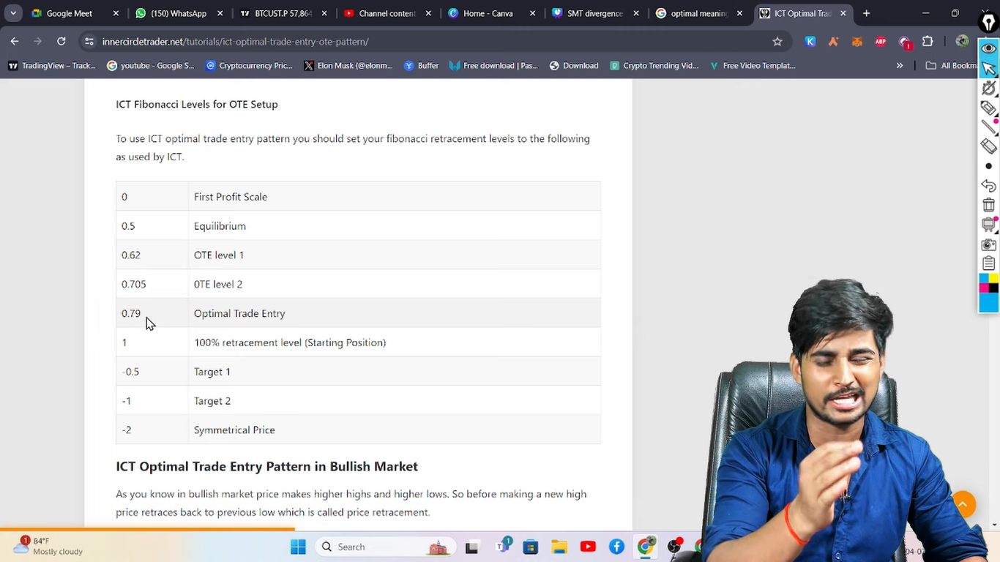
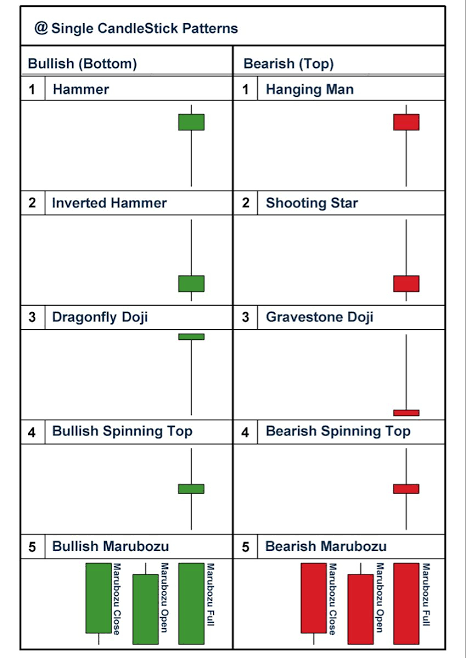
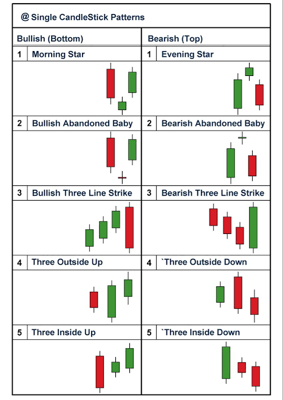

#ICT Smart Money Trading price acctions

`___________________________________________________________________________________

1- Market Structure :  

                     * Swing High

                     * Swing Low

                     SMC :

                          * Brak Of Structure   (BOS)   + -

                          * Change Of Character (CHoCH) + -
                            

                          * High or High   (HH) +
                           
                          * High or Low    (HL) +

                          * Low or Low     (LL) -
 
                          * Low or High    (LH) -

                     ICT :
   
                          * Market Structure Break (MSB) + -
                          * Fake MSB

                          * Market Structure Shift (MSS) + -
                          * Fake MSS

Long Trem Swings         :

                          * Long Term High     (LTH) +-

                          * Long Term Low      (LTL) -

Intermediate Term Swings :

                          * Mediate Term High  (MTH) +
                                                        | Classic  // Rebalance
                          * Mediate Trem Low   (MTL) -

Short Term Swings        :

                          * Short Trem High    (STH) +

                          * Short Trem Low     (STL) -

_____________________________________________________________________________________

2- Market Move :
                * Support 

                * Resistance

                * Demand

                * Supply

                * PoolBack

                * Support Be Cam Resistance

_____________________________________________________________________________________ 

                         
3- Inducement  :  
 

               * Liquidity Sweep

               * Liquidity Grup

               * Ticnecal Inducement

               * Support

               * Resistance

               * Chart pattern  :

                                        Doubel Toop

                                        Doubel Bottom

                                        Hed and Shoulders

                                        Flag Pattern

                                        Rising Wedge

                                        Falling Wedge

               * Candlestick pattern  :

                                        Hammer                    +

                                        Shooting star             -

                                        Inverted Hammer           +

                                        Hanging man               -

                                        Bullish Engulfing         +

                                        Berish Engulfing          -

                                        Piercing Pattern          +

                                        Dark Cloud Cover          -

                                        Morning Star              +

                                        Evening Star              -

                                        Three White Soldiers      +

                                        Three Black Crows         -

               * indicators :

                              Relative Strength Index (RSI)

                              Bollinger Bands (BB)

                              Moving Average (MA)

____________________________________________________________________________________

4- Liquidity :
               * Engineer Liquidity    (EL)

               * Liquidity pool        (LP)

               * TrendLine Liquidity   (TL)

               * Liquidity Void        (LV)

               * External Liquidity    (ERL)

               * Internal Liquidity    (IRL)
 
               * Bye Side Liquidity    (BSL)

               * Sell Side Liquidity   (SSL)

               * Drow On Liquidity     (DOL)

               * Run On Liquidity      (ROL)

               * High Resistance Liquidity Run  (HRLR)

               * Low Resistance Liquidity Run   (LRLR)

               * Equal High Liquidity (EQH)

               * Equal Low Liquidity  (EQL)

____________________________________________________________________________________

5- Fair Value Gap (FVG):

                       * FVG Start

                       * Consequent Encroachment (CE)

                       * FVG Fell

                       * Inversion

                       * Gap

                       * Volume Gap (VG)

                       * Displayment
 
                       * Buy Side Imbalance Sell Side Inefficiency (BISI)

                       * Sell Side Imbalance Buy Side Inefficiency (SIBI)

____________________________________________________________________________________
6- Order Flow (OF) :

                    * Brak Of Structure

                    * Equilibrium

                    * Displayment

                    * Liquidity Sweep

____________________________________________________________________________________

7- Order Block (OB) : 

                    * Replacement

                    * MinThreshold

                    * Displayment

                    * Liquidity Sweep

___________________________________________________________________________________

8- Mitigation Block (MB) :

                           * No  Liquidity Sweep ERL  

                           * Brak Of Structure

                           * Fill Lest OB

                           * MSS

                           * Mark MB

                           * Market create FVG Infornt of MB

___________________________________________________________________________________

9- Breaker Block (BB) :
  
                        * Liquidity Sweep

                        * Mart List OB

                        * Fill Lest OB

                        * Mss 

                        * Market create FVG Infornt of BB

                        * Inducement

                        * Market Sweep Liquidity OF Inducement

___________________________________________________________________________________

10- Rejection Block (RB) :

                         * Momentum

                         * Liquidity Sweep

                         * Mark RB

                         * Direct Entry
___________________________________________________________________________________

11- Reclaimed Order Block (ROB) :

                                 * BOS

                                 * Un MadieKet OB

                                 * Oppojict Moveent Tap OB

___________________________________________________________________________________

12- Liquidity Block (LB) :

                           * OB MB BB RB ROB

                           * OF

                           * Liquidity Sweep

___________________________________________________________________________________

13- Flip Block (FB) :

                     * Full Support Resistance

                     * Support To Be Resistance

                     * Resistance To Be Support

___________________________________________________________________________________

14- Discount & Premium : 

                         * Order Flow

                         * Premium

                         * Equilibrium

                         * Discount

___________________________________________________________________________________

15- Balanced Price Range (BPR) :

                                 * Bye And Sell FVG Sem Level

                                 * Fell FVG

___________________________________________________________________________________

16- Power of 3 (AMD) :

                       * Accumlation (A)

                       * Manipulation (PM)

                       * Distribution (D)
___________________________________________________________________________________

17- Interbanks Price Delivery Algorithm (IPDA) :

                                                 * Consolidation (CNS)

                                                 * Expansion (EXP)

                                                 * Retracement (RET)

                                                 * Recersal (REV)

___________________________________________________________________________________

18- Reversal Liquidity :

                        * Fist Line of Defence (FLOD)

                        * List Line of Defence (LLOD)

                        * Liquidity Sweep List Caldel

___________________________________________________________________________________

19- Sessions & Killzones & True Day Open :

                  AUD & NZD               * Sydney Open (SO)

                  JPY                     * Tokyo Open (TO)

                  EUR & USD & GBP & CAD   * London Open KillZone (LOK)

                  XAU & E/U G/U A/U U/C   * NewYork Open KillZone (NOK)

                                          * London and NewYork OverLap

                                          * London close KillZone

                                          * NewYork Close KillZone

                                          * Daly Candel Open (DCO)

                                          * True Day Open (TDO) NY12AM BD10AM

___________________________________________________________________________________

20- Smart Money Divergence (SMT) :

                                  * EURUSD/GBPUSD

                                  * EURCAD/GBPCAD

                                  * EURJPY/GBPJPY

                                  * AUDUSD/NZDUSD

                                  * AUDJPY/NZDJPY

                                  * EURCHF/GBCPHF

                                  * XAU/XAG

                                  * BTC/ETH

                                  * DXY/ALL
___________________________________________________________________________________
21- Optimal Trade Entry (OTE) :

                               * Entry

                               * StopLoss

                               * Terget 1

                               * Terget 2

                               * Retracement

                               * Terget 3
___________________________________________________________________________________

22- Daily Bias :

             * Sunday | Monday | Tuesday |  Wednesday | Thuraday | Friday | Saturday
             _________ ________  _________  _____________________ __________  _______

             (50%CON)  (35%Move) (Swideweg)      (40%Move)        (50%Move)   (CON)

             * 1 Sot 1 Kill
                                   Entry
             * Daley KillZone

___________________________________________________________________________________

23- Risk And Menye Management :

                     * 100% Capetal

                     * 10%  Deley Risk

                     * 2%   Par Trade

                     * 6%   Profet Terget 1:3
___________________________________________________________________________________

ICT Model
###########

___________________________________________________________________________________

24- Market Maker Model (MMXM) : 

                               $ Consolidatio

                               $ Up trand

                               $ Accumulation

                               $ Move Distribution

                               $ Mss

                               $ Tap Reclaim Order Block

                               $ Down trand
___________________________________________________________________________________

25- ICT Silver Bullet Model :

                               $ London  Bye

                               $ NewYork Sell

                               $ 5min Caldel

__________________________________________________________________________________

26- Turtle Soup Model : 

                       $ Liquidity Sweep

                       $ MSS

                       $ FVG

                       $ KillZone

                       $ TureDay open (Optiomel)

15m 5m 4h
__________________________________________________________________________________

27- Unicorn Model :

                   $ Liquidity Sweep

                   $ MSS

                   $ Displacement (FVG)

                   $ Inducement

                   $ Last Opposite color Candel

                   $ Overlap of (BB) And (FVG)
__________________________________________________________________________________

28- ICT Previous Day High & Low Model :

__________________________________________________________________________________

29- ICT Son's Model :

                     $ Drow On Liquidity

                     $ Manipulation
  
                     $ 1m 20s

                     $ MSS FVG OB
__________________________________________________________________________________

30- Change in State of Delivery Model (CISD) :

                                              $ SMT

                                              $ Daley timfrem 4h 

                                              $ 4h time timefrem 25m

                                              $ swing Low

                                              $ Reversel

                                              $ opojict color caldel brick entry

                                              $ Prives Caldel High

                                              $ Prives Caldel Low

___________________________________________________________________________________

31- News : 
           Federal Open Market Committe (FOMC)
           12Banks 8 Miting 
           100%To100% Interst Rate

           Consumer Price Index (CPI)
           cang prodacet Price   

           Producer Price Index (PPI)
           cang Prodacet all market price

           Non Farm Payroll (NFP)
           Job ceng 
           
           OPEC oiel price ceng

Janurey to Augest Manucoltionv 65%

___________________________________________________________________________________`

